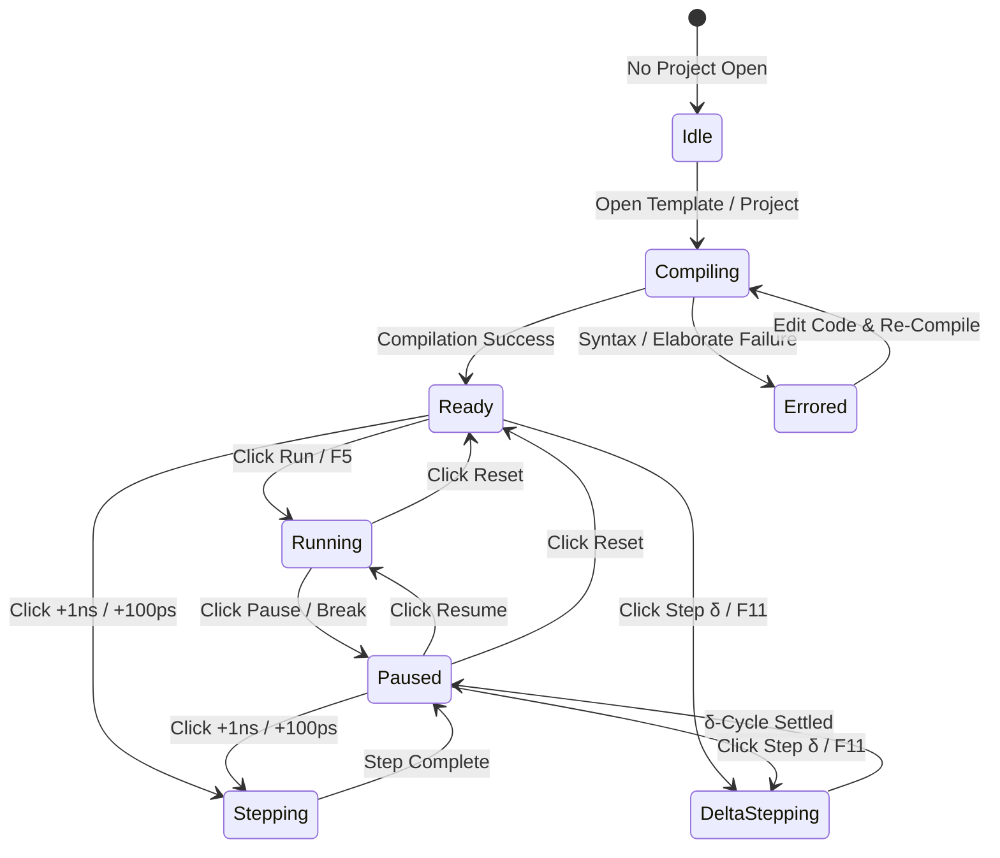

# Axiom Interaction Design, State Machines & Micro-Feedback

## 1. Perceptual Latency Budgets in Hardware Engineering

In hardware simulation and Electronic Design Automation (EDA), the perception of speed is not merely aesthetic—it fundamentally alters how engineers think and debug. 

When tool operations take 30 to 60 seconds (as in AMD Vivado's `xelab` file-based pipeline), engineers adopt batch-oriented, cautious workflows. When operations occur in milliseconds, engineers engage in **continuous exploratory design**, testing hypotheses, toggling input vectors, and inspecting timing consequences in real-time.

```
┌─────────────────────────────────────────────────────────────────────────────┐
│                       PERCEPTUAL LATENCY THRESHOLDS                         │
├───────────────────┬─────────────────────────────────────────────────────────┤
│ Threshold         │ Human Perception & Engineering Tool Requirement        │
├───────────────────┼─────────────────────────────────────────────────────────┤
│ 0 ms – 16 ms      │ Immediate / Continuous. Frame budget for 60 FPS canvas  │
│ (1 Frame @ 60Hz)  │ rendering, waveform zooming, cursor scrubbing, and      │
│                   │ schematic panning. Zero dropped frames permitted.       │
├───────────────────┼─────────────────────────────────────────────────────────┤
│ < 100 ms          │ Instantaneous Response. Limit for tactile button press, │
│                   │ DIP switch toggle, tab switching, and keyboard shortcut.│
│                   │ The user perceives the system as directly responding.   │
├───────────────────┼─────────────────────────────────────────────────────────┤
│ < 300 ms          │ Flow State Preserved. Upper limit for In-RAM Cranelift  │
│                   │ JIT compilation, AST elaboration, and linter squiggles. │
│                   │ User does not lose their train of thought.              │
├───────────────────┼─────────────────────────────────────────────────────────┤
│ > 1000 ms         │ Interruption of Flow. Must render an intermediate       │
│ (1 Second)        │ progress indicator, elapsed time counter, and an active │
│                   │ "Cancel" action to prevent user frustration.            │
└───────────────────┴─────────────────────────────────────────────────────────┘
```

---

## 2. Deterministic Simulation UI State Machine

The interface must faithfully mirror the simulation kernel's internal lifecycle without race conditions or conflicting controls. Axiom models simulation execution as a strict **Finite State Machine (FSM)**:



### UI Control Matrix by State

```
State        Run Button     Step Buttons    Reset Button   Editor Editing   Force Signal
──────────────────────────────────────────────────────────────────────────────────────────
Idle         Disabled       Disabled        Disabled       Disabled         Disabled
Compiling    Disabled       Disabled        Disabled       Read-Only        Disabled
Ready        Play (Green)   Enabled         Enabled        Editable         Enabled
Running      Pause (Rose)   Disabled        Enabled        Editable (Deb)   Disabled
Paused       Play (Green)   Enabled         Enabled        Editable         Enabled
Stepping     Disabled       Disabled        Disabled       Editable         Disabled
Errored      Disabled       Disabled        Disabled       Editable         Disabled
──────────────────────────────────────────────────────────────────────────────────────────
```

> [!IMPORTANT]
> **Defensive Button Feedback:**
> When a button is disabled (e.g., `Step δ` when no project is loaded or compilation failed), clicking or hovering must display an informative tooltip explaining *why* the action is unavailable and *how* to unlock it (e.g., `"Design must compile without syntax errors before stepping simulation"`), rather than silently ignoring clicks.

---

## 3. Direct Manipulation & Tactile Micro-Interactions

### 3.1. Virtual Breadboard DIP Switch Dynamics
In `VirtualLabRack.tsx`, 8-bit DIP switches simulate physical SPST switches found on FPGA evaluation boards (Digilent Basys 3, Nexys A7):
- **Visual Anatomy**: A dark recessed switch well (`#0f1217`) housing a raised tactile rocker lever.
- **Toggle Animation**: Flipping the switch triggers a sub-100ms micro-transition moving the rocker vertically with an subtle optical bevel highlight.
- **Illuminated Status Pill**: An integrated LED badge glows bright emerald (`#10b981`) when closed (Logic `1`) and dim slate (`#475569`) when open (Logic `0`).
- **Immediate In-RAM Stimulus**: Toggling instantly calls `engineBridge.injectStimulus(port, value)`, re-evaluates all dependent combinational gates in RAM, and updates waveform traces without waiting for a clock tick.

### 3.2. Tactical Pushbutton Strobe Dynamics
Physical pushbuttons (such as `RESET` and `STEP CLK`) feature momentary contact mechanics:
- **Depression**: On `mouseDown` / `touchStart`, the button depresses with a 1px offset and glowing cyan border.
- **Strobe Release**: For active-low resets (`rst_n`), pressing immediately forces `0`; a built-in release timer automatically strobes the pin back to `1` after 250ms, simulating a human finger press and preventing the circuit from remaining permanently halted.

### 3.3. Dual Monotonic Waveform Cursor Dragging
In `WaveformViewer.tsx`, timing measurements depend on two independent vertical cursor pins:
- **Cursor A (Cyan `#06b6d4`)** and **Cursor B (Amber `#f59e0b`)**.
- **Edge Snapping**: Dragging a cursor near a signal transition edge snaps within a 6px threshold, allowing exact cycle-accurate setup and hold time measurements.
- **Floating HUD Badge**: As cursors are dragged, a floating badge displays:
  $$\Delta t = |t_B - t_A| = 10.000\text{ ns} \quad \left(f = \frac{1}{\Delta t} = 100.00\text{ MHz}\right)$$

---

## 4. Keyboard Navigation & Omnibar Modality

Power users and FPGA architects navigate primarily via the keyboard. Axiom enforces full keyboard accelerator parity:

### 4.1. Global Keyboard Shortcuts Table

```
Shortcut           Action                        Scope
───────────────────────────────────────────────────────────────────────────────
Ctrl+K / Cmd+K     Open Omnibar Command Palette  Global
F5                 Run / Pause Simulation        Global
F10                Step Physical Time (+1 ns)    Global
F11                Step Discrete Delta Cycle (δ) Global
Shift+F5           Reset Simulation to t=0       Global
Ctrl+S / Cmd+S     Trigger In-RAM JIT Compile    Code Editor
F                  Slice Logic Cone (Fan-in)     Schematic DAG
O                  Slice Logic Cone (Fan-out)    Schematic DAG
Escape             Dismiss Modal / Unfocus       Global (Stacked)
───────────────────────────────────────────────────────────────────────────────
```

### 4.2. Spotlight-Style Omnibar (`OmnibarModal.tsx`)
Triggered via `Ctrl+K` or `Cmd+K`:
- **Fuzzy Matching**: Matches signals, project files, starter templates, and studio commands with sub-10ms query times.
- **Categorized Sections**:
  - `Actions`: Run, Compile, Step, Reset, Export VCD, Export SAIF.
  - `Signals`: Instant inspection and waveform toggle for any net in the elaborated hierarchy.
  - `Files`: Jump directly to any Verilog, testbench, or constraint source.
  - `Templates`: Quick-load industry designs (RV32I, UART, SPI, PWM, ALU).
- **Keyboard Trapping & Arrow Navigation**: Up/Down keys cycle through results with active blue pill highlight; Enter executes and closes; Escape dismisses.

### 4.3. Stacked Escape Key Architecture
The `Escape` key must never cause unpredictable layout shifts. Axiom implements a priority-ordered dismiss stack:
1. **Priority 1**: Dismiss active Autocomplete dropdown or Monaco hover tooltip.
2. **Priority 2**: Dismiss Omnibar / New Project / Add Source Modal.
3. **Priority 3**: Clear active Cross-Probing selection and Logic Cone Slicing halos.
4. **Priority 4**: Restore Maximized Panel (``) back to split view.
5. **Priority 5**: Collapse expanded Bottom Dock down to status bar.

---

## 5. Optimistic UI vs. Engine Ground Truth

In real-time hardware simulation, UI components must balance responsiveness with mathematical correctness:

```
User Action (Force Signal "0xFF")
       │
       ├─────────────────────────────────────────┐
       ▼ (Instant Optimistic Feedback: <16ms)    ▼ (Engine Ground Truth: ~2ms)
[Update Virtual Lab Hex Display]          [Cranelift JIT In-RAM Re-evaluation]
[Set Gutter Value to "0xFF"]                     │
       │                                         ▼
       └─────────────────────────────────> [Stratified Event Queue Execution]
                                                 │
                                                 ▼
                                          [Waveform Trace Written to Buffer]
                                          [Voltage Sag Computed in Telemetry]
                                          [Cross-Probing Confirmed Across DAG]
```

- **Optimistic Phase**: Input controls (DIP switches, rotary dial, force modal) immediately reflect user intent visually, preventing sluggish tactile feedback.
- **Verification Phase**: The JIT engine elaborates and steps the event queue. Once execution completes, all downstream visualizers (waveforms, schematic wire probes, power dials) receive the validated engine state.
- **Rollback Handling**: If an invalid state or compile error occurs during the operation, the UI rolls back the optimistic control to the last stable checkpoint and displays an inline toast notification.

---

## 6. Monaco Editor Katana Slash Kinetic Cursor Physics

To transform code authoring and navigation into a fluid, tactile experience while maintaining professional aesthetic discipline, Axiom implements a custom **White Katana Slash Cursor Effect** directly over the Monaco Editor canvas:

### 6.1. Exponential Follower Physics ($\lambda \approx 18\text{ s}^{-1}$)
Rather than an instantaneous caret snap or a sluggish linear tween, the trailing blade follower coordinates $\vec{p}_{\text{trail}}$ track the true editor caret $\vec{p}_{\text{target}}$ using continuous exponential decay:
$$\vec{p}_{\text{trail}}(t + \Delta t) = \vec{p}_{\text{target}} + (\vec{p}_{\text{trail}}(t) - \vec{p}_{\text{target}}) \cdot e^{-\lambda \Delta t}$$
- $\lambda = 18.0$: At 60 FPS, the follower catches up $\sim 50\%$ in 38ms and $\sim 85\%$ in 100ms, creating a tuned $\sim 90\text{ms}$ trailing lag.
- **Frame-Rate Invariant**: The decay is calculated against true elapsed time $\Delta t$, ensuring completely identical kinetic velocity on 60Hz, 120Hz ProMotion, and 240Hz monitors.

### 6.2. Tapered Katana Blade Geometry
When moving ($|\vec{p}_{\text{target}} - \vec{p}_{\text{trail}}| > 0.4\text{px}$), the space between the follower and caret is filled as a tapered Japanese katana blade:
- **Leading Edge**: The vertical line height ($H \approx 20\text{px}$) of the active line caret in pure white (`#ffffff`).
- **Trailing Edge**: A needle-sharp point at $(x_{\text{trail}}, y_{\text{trail}} + 0.5 H)$.
- **Blade Contours**: Quadratic curves arcing from the leading edge corners back to the trailing apex, filled with a white-to-transparent linear gradient (`rgba(255, 255, 255, 0.95)` to `0.0`).
- **Hamon / Central Spine**: A razor-thin luminous line ($1.2\text{px}$, `#ffffff`) along the center of the cut stroke.

### 6.3. Sori-Curved Slash Strike Arcs
When jumping between lines or across words ($d > 12\text{px}$):
- Generates a transient slash strike with natural katana blade curvature (*sori*) perpendicular to the movement vector.
- Emits 2–3 microscopic luminous cutting glints that disperse along the cutting arc.
- Dissolves with a quadratic fade-out $\alpha(t) = (1 - t/T)^2$ over $T = 180\text{ms}$.

### 6.4. Self-Sleeping Rendering Lifecycle
- The `requestAnimationFrame` loop executes only when the cursor is in motion or when active strikes are dissolving.
- As soon as the trailing follower reaches equilibrium ($d < 0.25\text{px}$) and all strikes fade, the canvas is cleared and the RAF loop halts, ensuring **0% idle CPU and GPU load**.

---

## 7. Tactile Form Controls & Custom Popover Micro-Interactions

### 7.1. Acrylic Popover Dropdown Mechanics (`Select.tsx`)
Replacing browser-native `<select>` elements with custom React popovers requires precise kinetic physics and focus choreography:
- **Optical Entrance Animation**: Popovers open using `@keyframes axiom-popover-in` transitioning from `opacity: 0; transform: translateY(-4px) scale(0.98)` to `opacity: 1; transform: translateY(0) scale(1)` over $120\text{ms}$ with `cubic-bezier(0.16, 1, 0.3, 1)`.
- **Z-Index & Stacking Isolation**: The popover container sits at `z-index: 10000` with `background: #0f1217`, a subtle `1px solid var(--border-subtle)` border, and an acrylic box shadow (`0 12px 32px rgba(0, 0, 0, 0.6)`), preventing visual bleed into adjacent panels.
- **Boundary-Safe Alignment Physics**: Anchoring supports `align="left" | "right"`. Right-aligned popovers (used in the global header for language and layout pickers) anchor to the right edge (`right: 0`), completely eliminating horizontal off-screen clipping.
- **Outside Click & Blur Dismissal**: Clicking outside the trigger button or popover immediately closes the menu and smoothly restores document focus.

### 7.2. Full Keyboard Navigation Parity
Custom dropdowns must meet or exceed native browser accessibility:
- **`Space` / `Enter`**: Toggles popover open/closed state. When focused on a list item, `Enter` commits the selection.
- **`ArrowDown` / `ArrowUp`**: Cycles through selectable options, auto-skipping disabled items and section group headers (`SelectGroup`). The active item receives a visible cyan highlight pill (`rgba(59, 130, 246, 0.15)`).
- **`Escape`**: Immediately dismisses the popover and returns focus to the parent trigger button without side effects.

### 7.3. Unified Density Tiers (`xs`, `sm`, `md`)
To maintain visual hierarchy across different IDE contexts, all UI form primitives (`Select`, `Input`, `Button`) strictly adhere to three standardized vertical density tiers:
- **`xs` (24px height, 11px font)**: Engineered for the dense 42px header bar, compact status strips, and instrument bay headers.
- **`sm` (28px height, 12px font)**: Engineered for secondary panel toolbars, collapsible bottom dock tabs, and signal hierarchy search filters.
- **`md` (34px height, 13px font)**: Engineered for modal dialogs (New Project, Add Source, Stimulus Painter) and primary configuration wizards.

### 7.4. Micro-Tactile Button Scaling & Clearable Actions
- **Button Haptics**: Button primitives implement `:active: scale(0.97)` physical micro-scaling with `transition: transform 60ms cubic-bezier(0.2, 0.8, 0.2, 1)`, providing immediate visual confirmation of physical depression.
- **Clearable Inputs (`Input.tsx`)**: Text inputs with `clearable={true}` render an inline `` button when non-empty, clearing search filters with a single tap/click and restoring input focus.

