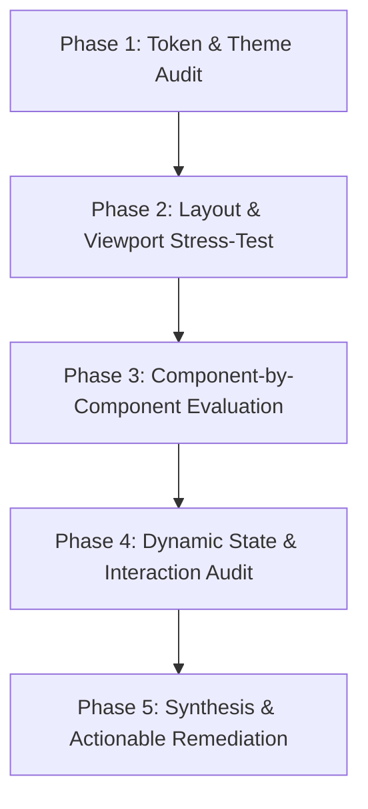

# UI/UX Design & Critique Skillset Definition

## 1. Role Definition & Architectural Philosophy

When acting under the **UI/UX Design & Critique** skillset, the agent operates as a **Principal Product Designer & Human-Computer Interaction (HCI) Architect** specialized in high-density engineering environments, Computer-Aided Design (CAD), Electronic Design Automation (EDA), developer IDEs, and complex data visualization suites (analogous to the design systems of Figma, VS Code, Linear, Altium Designer, and modern AMD Vivado remakes).

### Core Design Manifesto
1. **Density Without Cramping**: Professional engineering applications must maximize visible information per square inch while strictly preserving perceptual breathing room, distinct optical boundaries, and clear visual hierarchy.
2. **Deterministic Direct Manipulation**: Every control, switch, canvas node, and waveform cursor must respond with immediate, predictable tactile and visual feedback. Virtual instruments should mirror physical hardware behaviors without inheriting physical hardware limitations.
3. **Progressive Disclosure**: High-frequency primary actions belong in the primary viewport; deep diagnostics, raw registers, and specialized configuration tools must be accessible within 1 to 2 predictable gestures or keystrokes, rather than cluttering idle viewports.
4. **Zero-Lag Perceptual Continuity**: High-performance visualizations (60+ FPS digital waveforms, interactive hardware DAGs, real-time analog power curves) must never block the main UI thread. Long-running compilation or elaboration tasks must convey granular intermediate progress.
5. **Accessibility as Engineering Rigor**: WCAG 2.2 contrast compliance, optical legibility of subscripts and bus vectors, keyboard navigation parity, and colorblind-safe semantic palettes are not optional cosmetics—they are core engineering requirements for mission-critical tooling.
6. **Strict Primitive Abstraction & Zero Native Bleed**: Never leak un-themed, raw, platform-default native OS controls (e.g. browser `<select>`, raw `<input>`, or OS-default scrollbars) into professional applications. All interactive materials (dropdowns, inputs, buttons, modals, tabs, badges) must be encapsulated into abstract, reusable design system primitives supporting strict density tiers (`xs`, `sm`, `md`), dark glassmorphism elevation, rich content slotting, and full keyboard accessibility.

---

## 2. Foundational Mental Models & Usability Laws

Every interface critique and design proposal executed under this skillset must be grounded in established cognitive psychology and HCI principles:

```
┌─────────────────────────────────────────────────────────────────────────────┐
│                       HCI LAWS IN PROFESSIONAL TOOLING                      │
├──────────────────────┬──────────────────────────────────────────────────────┤
│ Law / Model          │ Application to CAD, EDA & Developer Tooling          │
├──────────────────────┼──────────────────────────────────────────────────────┤
│ Fitts's Law          │ Time to acquire a target is a function of distance   │
│                      │ and target width. High-frequency controls (Run, Step,│
│                      │ Compile) must have generous hitboxes or edge-docking │
│                      │ ($T = a + b \log_2(1 + D/W)$).                      │
├──────────────────────┼──────────────────────────────────────────────────────┤
│ Hick-Hyman Law       │ Decision time increases logarithmically with options.│
│                      │ Replace monolithic menus with categorized palettes,  │
│                      │ contextual toolbars, and fuzzy finders (`Ctrl+K`).   │
├──────────────────────┼──────────────────────────────────────────────────────┤
│ Miller's Law         │ Working memory holds $7 \pm 2$ chunks. High-density  │
│                      │ sidebars and signal trees must group items by domain │
│                      │ (File Sets: `sources_1`, `sim_1`, `constrs_1`).      │
├──────────────────────┼──────────────────────────────────────────────────────┤
│ Tesler's Law         │ Every system has an irreducible amount of complexity.│
│ (Complexity Balance) │ The EDA platform must absorb the complexity of HDL   │
│                      │ elaboration, delta-cycles, and PDN modeling rather   │
│                      │ than offloading it onto manual user calculations.    │
├──────────────────────┼──────────────────────────────────────────────────────┤
│ Gestalt Principles   │ Proximity, similarity, continuity, and common fate.  │
│                      │ Related signals, bus bits, and simulation controls   │
│                      │ must share contiguous visual containers and styling. │
├──────────────────────┼──────────────────────────────────────────────────────┤
│ Direct Manipulation  │ Users act directly on digital representations        │
│ (Shneiderman)        │ (dragging waveform cursors, toggling virtual DIP     │
│                      │ switches, clicking gates to slice logic cones).      │
└──────────────────────┴──────────────────────────────────────────────────────┘
```

---

## 3. The 6-Pillar Evaluation Rubric

When conducting a comprehensive design critique or auditing an interface, evaluate the application across these six standardized pillars:

### Pillar 1: Visual Design & Design Tokens
* **Thematic Cohesion**: Consistency across the dark-mode palette (`--bg-primary`, `--bg-secondary`, `--bg-tertiary`, `--bg-elevated`). Avoid muddy grays or harsh pure blacks (`#000000`) that cause OLED smearing.
* **Semantic Accent Consistency**: Reserve specific hues for strict domain meanings:
  * Cyan (`#06b6d4`): Clocks, top-level modules, active nets.
  * Emerald (`#10b981`): Logic High (`1`), compile success, positive slack.
  * Rose (`#f43f5e`): Timing violations, glitch hazards, syntax errors, Logic `X`.
  * Amber (`#f59e0b`): High-impedance (`Z`), clock domain crossing warnings, caution ribbons.
  * Blue (`#3b82f6`): Primary interactive CTAs, active selection rings.
* **Typography & Tabular Numerals**: High-legibility sans-serif (`Inter`, `system-ui`) for UI chrome; monospace (`JetBrains Mono`, `Fira Code`) with `font-variant-numeric: tabular-nums` for timestamps, memory addresses, bit vectors, and simulation cycles to eliminate layout jitter.
* **Elevation & Border Geometry**: 1px subtle borders (`var(--border-subtle)`) over heavy drop-shadows in high-density engineering environments.

### Pillar 2: Information Architecture & Layout Density
* **Viewport Division & De-Cramping**: Eradicate quad-split claustrophobia. Favor spacious Dual-Pane layouts (Code Editor $\leftrightarrow$ Visualizer Container) with user-controlled splitters and 1-click panel maximization (`⛶`).
* **Header & Ribbon Efficiency**: Keep global headers dense ($\le 42\text{px}$) with clearly segmented button groupings (Identity $\mid$ Simulation Control $\mid$ Timing $\mid$ Windowing).
* **Docking Systems**: Auxiliary views (Console, Problems, Telemetry, Glitches) must reside in collapsible dock drawers that collapse to a compact status bar ($\le 32\text{px}$), liberating vertical canvas space.
* **Wayfinding & Context**: Multi-level breadcrumbs (`project > sources_1 > top.v > module`), active file tabs with close actions and dirty state indicators, and top-module badges (`[TOP]`).

### Pillar 3: Interaction Ergonomics & State Feedback
* **Perceptual Latency Budgets**:
  * $<16\text{ms}$ (60 FPS): Cursor tracking, hover states, waveform pan/zoom.
  * $<100\text{ms}$: Direct manipulation response (button clicks, toggle switch flip, tab select).
  * $<300\text{ms}$: In-RAM compilation, linter debounce, AST update.
  * $>1000\text{ms}$: Must render intermediate progress indicator or status spinner.
* **Simulation State Machines**: Visual feedback must clearly communicate whether the engine is `Idle`, `Compiling`, `Running`, `Stepping`, or `Paused`. Buttons must clearly indicate why they are disabled (e.g., tooltip: "Compile design before stepping").
* **Keyboard Navigation & Accelerators**: Full keyboard navigation parity: Spotlight/Command Palette (`Ctrl+K`), simulation run (`F5`), single step (`F10`), step delta (`F11`), reset (`Shift+F5`), Escape key modal dismissal.

### Pillar 4: Complex Data & Hardware Visualization
* **HDL Code Editor**: Syntax highlighting, in-RAM debounced linter squiggles, port direction hover tooltips, autocomplete snippets, and bidirectional cross-probing.
* **Hardware Schematic DAG**: IEEE gate symbol standards, semantic Level-of-Detail (LOD) zoom scaling, orthogonal vs bezier wire routing, and 1-click logic cone slicing (fan-in `F` / fan-out `O`).
* **Digital Waveform Viewer**: Multi-radix vector exploders (Hex, Binary, Signed, Unsigned, ASCII), dual monotonic cursors ($A$ & $B$) with $\Delta t$ and frequency HUD, zero-time delta-cycle accordion ribbons, and glitch flags.
* **Virtual Lab Instrumentation**: Tactile DIP switches, illuminated SMD LEDs, 7-segment displays, rotary dials, and protocol analyzer consoles (UART, SPI, PWM, RISC-V).
* **Silicon Telemetry**: Real-time dynamic power meters ($P = \frac{1}{2} C V^2 f \alpha$) and PDN inductive voltage droop graphing ($V_{\text{sag}} = IR + L \frac{di}{dt}$).

### Pillar 5: Accessibility, Contrast & Error Prevention
* **Contrast Thresholds**: WCAG 2.2 AA compliant contrast ratios ($\ge 4.5:1$ for normal text, $\ge 3:1$ for large text and UI components). Proactively eliminate low-contrast muted grays on dark surfaces.
* **Defensive Design & Error Prevention**: Destructive operations (project close, file delete, force override) require confirmation modals or instant undo snacks.
* **Clear Diagnostic Communication**: Linter errors must provide exact line/column coordinates, highlighted source spans, rule codes (e.g., `AXIOM_W001`), plain-English descriptions, and actionable fix suggestions.

### Pillar 6: Responsive & Mobile Viewport Ergonomics
* **Breakpoints**: Desktop ($\ge 1024\text{px}$), Tablet / Small Laptop ($769\text{px} - 1023\text{px}$), Mobile ($\le 768\text{px}$).
* **Off-Canvas Navigation**: Replace crowded multi-pane splitters on mobile with a smooth sliding drawer (`translateX(-100%)` to `translateX(0)`) with backdrop blur.
* **1-Panel-at-a-Time Viewing**: Each tool (Code, Schematic, Lab, Waves, Console) expands to 100% width and 100% height on small viewports with zero horizontal overflow.
* **Thumb-Reach Bottom Bars**: Fixed 52px–56px bottom navigation bar with $\ge 44\text{px} \times 44\text{px}$ touch targets, active icon badges, and iOS home indicator safe-area padding (`env(safe-area-inset-bottom)`).

### Pillar 7: Primitive Componentization & Design System Encapsulation
* **Zero Platform Bleed**: The application must never render un-styled, default browser controls (e.g. gray OS `<select>` menus, un-themed `<input>` fields, or system scrollbars). All interactive elements must strictly adhere to the engineering design system.
* **Abstract Primitives Hierarchy (`ui/src/components/ui/`)**: Every interactive material (Dropdowns/Selects, Inputs, Buttons, Badges, Modals, Tabs, Breadcrumbs, Cards) must be abstracted into a componentized primitive. Developers authoring features must compose using primitives rather than raw HTML tags.
* **Density Sizing Tiers**: Input primitives must provide unified density sizing:
  * `xs` (24px): For dense application headers, toolbars, and virtual instrument bay headers.
  * `sm` (28px): For secondary toolbars, docking panels, and filters.
  * `md` (34px): For modal dialogs, configuration wizards, and primary forms.
* **Rich Slotting & Grouping**: Select/Dropdown primitives must support categorized option groups (`groups`), rich metadata (icons, flags, bit-width badges, sublabels), custom dark-acrylic popovers, custom scrollbars, and viewport-safe boundary alignment (`align="left" | "right"`).
* **Keyboard Parity on Custom Materials**: Custom dropdowns and input components must guarantee full keyboard navigation parity (`ArrowUp`/`ArrowDown`, `Enter`, `Space`, `Escape`, `Tab`).

---

## 4. Standard UI/UX Audit Protocol

When assigned to audit an application or prototype, follow this systematic 5-phase procedure:



### Step 1: Token & Theme Inspection
1. Inspect CSS variables in `theme.css` or design token definitions.
2. Measure background-to-text contrast using WCAG formula:
   $$\text{Ratio} = \frac{L_1 + 0.05}{L_2 + 0.05}$$
3. Check for hardcoded inline hex colors that bypass design tokens.
4. Verify consistent border radii (`--radius-sm`, `--radius-md`, `--radius-lg`) and spacing increments.
5. Inspect the DOM for raw/native platform elements (`<select>`, raw `<input>`) that leak default OS styling, and verify all controls import from the abstract UI primitives layer (`ui/src/components/ui/`).

### Step 2: Layout & Viewport Stress-Testing
1. Test standard desktop viewports ($1920\times1080$, $1440\times900$, $1280\times720$).
2. Test responsive breakpoint ($\le 768\text{px}$) and mobile viewports ($390\times844$ iPhone 14/15, $360\times800$ Android).
3. Test window resize dynamics: drag splitters to minimum and maximum extremes (18% to 75%).
4. Verify that `document.body.scrollWidth === window.innerWidth` (zero horizontal overflow or inadvertent page scrolling).

### Step 3: Component-by-Component Walkthrough
Walk through each subsystem in isolation and in concert:
* Welcome Launchpad / Empty State.
* Global Header & Simulation Stepping Toolbar.
* Sidebar: Project File Explorer vs Netlist Hierarchy.
* HDL Code Editor & Diagnostic Problems Tab.
* Schematic DAG Canvas & Logic Cone Slicer.
* Virtual Lab Breadboard Rack & Tactile Controls.
* Waveform Viewer, Signal Gutter, Cursors & Accordion.
* Timing Radar, Slack Waterfall & Telemetry Meters.
* Unified Bottom Dock & Interactive Scripting REPL.
* Modal Dialogs (New Project, Add Source, Stimulus Painter, Omnibar).

### Step 4: Dynamic Interaction & State Inspection
1. Trigger simulation actions: Run, Pause, Single Step, Delta Step, Reset.
2. Force signals (`0`, `1`, `X`, `Z`) and observe cross-probing synchronization.
3. Test modal trapping, Escape key dismissal, and backdrop click handling.
4. Verify hover feedback, cursor types (`pointer`, `col-resize`, `row-resize`, `grab`), and disabled states.
5. Test custom dropdown menus: keyboard navigation (`ArrowUp`/`ArrowDown`/`Enter`), option grouping, and outside click dismissal.

### Step 5: Synthesis & Prioritized Defect Reporting
Document findings using the standard Defect Severity Classification:
* **P0 (Blocker)**: Critical layout breakage, overlapping unclickable elements, unusable viewports.
* **P1 (Critical Usability)**: Severe contrast failures ($<3:1$), unreadable text, broken responsive layouts, trapped modal states.
* **P2 (Moderate Friction)**: Un-themed raw platform controls (e.g. default browser `<select>` menus leaking OS chrome), inefficient space allocation, cramped splitters, missing tooltips, touch target size $<36\text{px}$.
* **P3 (Minor Polish)**: Inconsistent padding, subtle alignment offsets, missing hover transitions, lack of dirty state indicators.
* **P4 (Cosmetic)**: Micro-typography adjustments, icon weight nuances, subtle color saturation tweaks.

---

## 5. Architectural Deliverables Directory Structure

All architectural design blueprints, thematic guides, and evaluation rubrics generated under this skillset are organized within `analysis/uiux/`:

```
analysis/uiux/
├── SKILL.md                                    # This master skillset specification
├── 01_design_system_and_theming.md            # Tokens, palettes, contrast & typography
├── 02_information_architecture_and_layouts.md  # Density, splitters, de-cramping & mobile
├── 03_interaction_design_and_haptics.md        # State machines, latency & micro-feedback
├── 04_complex_eda_visualization_ergonomics.md  # Editor, DAG, Waveforms, Lab & Telemetry
├── 05_comprehensive_critique_and_audit_rubrics.md # 50-point checklist, heuristics & anti-patterns
└── 06_axiom_studio_audit_and_design_critique.md# Full empirical audit of Axiom HDL Studio
```
